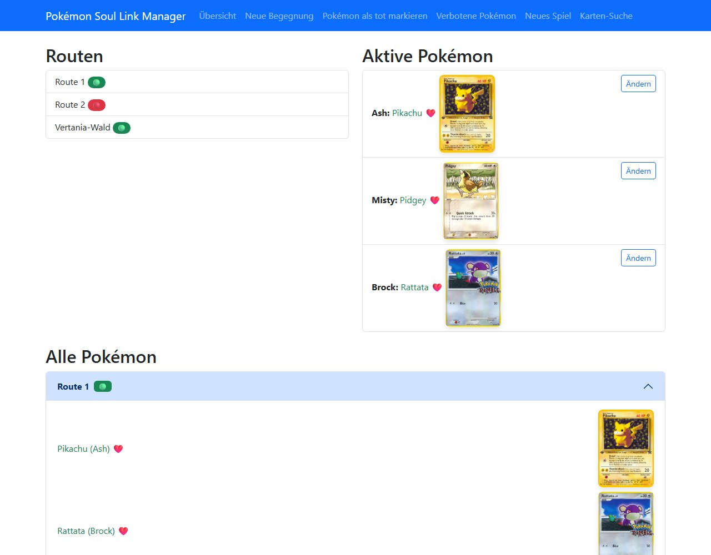

# Pokémon Soul Link Manager

Eine Flask-Web-App zum Verwalten von **Soul Link Nuzlocke**-Runs mit bis zu drei Spielern. Die App merkt sich Begegnungen pro Route, sperrt bereits gefangene Pokémon samt ihrer Entwicklungslinie und setzt die Soul-Link-Regel automatisch um: Stirbt ein Pokémon, sterben alle Pokémon derselben Route.



## Funktionen

- **Neues Spiel**: Spieler anlegen (kommagetrennt), alle bisherigen Daten werden zurückgesetzt
- **Neue Begegnung**: Pro Route ein Pokémon je Spieler eintragen
- **Sperrliste**: Gefangene Pokémon und ihre komplette Entwicklungslinie (über die [PokéAPI](https://pokeapi.co/)) können nicht erneut gefangen werden
- **Soul Link**: Wird ein Pokémon als tot markiert, sterben alle Pokémon der Route und die Route wird geschlossen
- **Aktive Pokémon**: Übersicht, welches Pokémon jeder Spieler gerade nutzt – nach einem Tod wird direkt zur Auswahl eines neuen weitergeleitet
- **Sammelkarten**: Zu jedem Pokémon wird ein passendes Kartenbild von [TCGdex](https://tcgdex.dev/) angezeigt, außerdem gibt es eine Karten-Suche

## Soul-Link-Regeln

1. **Jedes Pokémon nur einmal**: Fängt ein Spieler Pikachu, kann niemand mehr Pichu, Pikachu oder Raichu fangen.
2. **Routen sind verlinkt**: Alle auf einer Route gefangenen Pokémon teilen ihr Schicksal. Stirbt eins, sterben alle.
3. **Geschlossene Routen**: Auf einer Route mit toten Pokémon sind keine neuen Begegnungen mehr möglich.

## Installation

Voraussetzung: Python 3.10 oder neuer.

```bash
git clone https://github.com/Lui5380s/Pokemon_SoulLink.git
cd Pokemon_SoulLink
python -m venv .venv
source .venv/bin/activate      # Windows: .venv\Scripts\activate
pip install -r requirements.txt
python run.py
```

Danach die App unter <http://127.0.0.1:5000> öffnen. Die SQLite-Datenbank wird beim ersten Start automatisch unter `data/` angelegt.

Optional kann in einer `.env`-Datei ein eigener `FLASK_SECRET_KEY` gesetzt werden. Mit `FLASK_DEBUG=1` startet die App im Debug-Modus.

## Projektstruktur

```
run.py                  Einstiegspunkt, erstellt die Flask-App
database/schema.sql     Datenbankschema (Trainer, Routen, Pokémon, Sperrliste, aktive Pokémon)
src/
  db_manager.py         Datenbankverbindung und Initialisierung
  logic.py              Spiellogik: Begegnungen, Soul Link, Sperrliste, PokéAPI
  routes.py             Flask-Routen und JSON-Endpunkte
  tcg_api.py            Kartenbilder und -suche über die TCGdex-API
  reset_db.py           Setzt die Datenbank komplett zurück
webapp/
  templates/            Jinja-Templates (Bootstrap 5)
  static/               CSS und JavaScript
```

## Verwendete APIs

- [PokéAPI](https://pokeapi.co/) – Pokémon-Daten und Entwicklungsketten
- [TCGdex](https://tcgdex.dev/) – Pokémon-Sammelkarten

Pokémon und alle zugehörigen Namen sind Marken von Nintendo, Game Freak und The Pokémon Company. Dies ist ein inoffizielles Fan-Projekt.

## Lizenz

[MIT](LICENSE)
